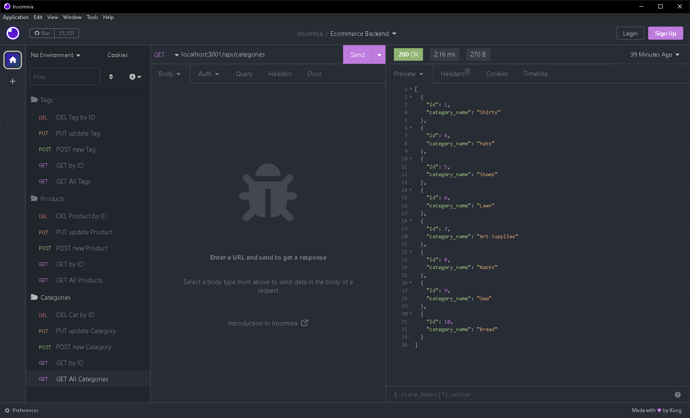

# Ecommerce Backend with MySQL

## Description

This app uses `sequelize v5.21.7` and `Insomnia` to demonstrate a backend database for an e-commerce site

Users can `GET - POST - PUT - DELETE` items from the database in three catagories: `Categories`, `Products`, and `Tags`

## Table of Contents

- [Installation](#installation)
- [Usage](#usage)
- [License](#license)

## Installation

Using your bash terminal:

Check if you have node installed by running code below, this app was built using `v8.1.4`

If you don't, download it here: [Node.js](https://nodejs.org/en/)

```
npm -v
```

Install the node modules with:

```
npm i
```  

You will also need MySQL installed, once you do open a new shell and initialize the database using:

```
mysql -u root -p
```

You'll be prompted for a password then run the following to initialize the database, then quit the MySQL shell:

```
source db/schema.sql

quit
```

Then run the following to seed the database:

```
npm run seed
```

## Usage

For a video demo of the apps functionality go to: [Video Demo](https://drive.google.com/file/d/1TgQx-RxRj-7m-95EyovcdfR4RCjQTDUI/view)

Once you've opened the app in vscode and installed the node modules run the following to start the server:

```
node server.js
```

You can then jump over to `Insomnia` to test the endpoints at:

```
localhost:3001/api/tags
localhost:3001/api/products
localhost:3001/api/categories

-to access a specific ID number-

localhost:3001/api/tags/:id
localhost:3001/api/products/:id
localhost:3001/api/categories/:id
```

You should see similar JSON data:



## License

This app is licensed under the [MIT License](./LICENSE)

## How to Contribute

Reach out on [Github](https://github.com/Tooboi)
